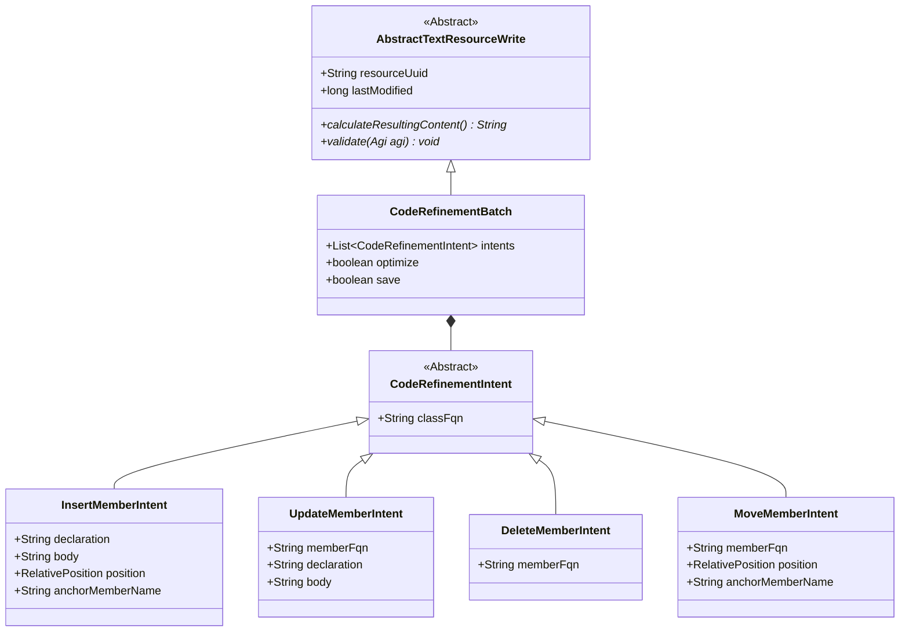

/* Licensed under the Anahata Software License (ASL) v 108. See the LICENSE file for details. Força Barça! */
# CodeRefiner Evolution Plan (V3)

This document outlines the architectural shift for structural Java manipulation, moving from "blind" path-based execution to "Resource-Centric" batch refinement.

## 1. The Vision
The goal is to provide a "Total Football" experience for code refinement. Instead of proposing individual method updates, the ASI proposes a **Refinement Batch** targeted at a specific **Managed Resource**.

### Key Principles:
1. **Context-Locked**: Refinement tools strictly require a `resourceUuid`. The resource **must** be in the conversation context (RAG message) before refinement can be proposed.
2. **Read-Before-Write**: By using `resourceUuid` and `lastModified`, we ensure the model has "seen" the code it is about to change, preventing "ghost surgery" on stale or unseen files.
3. **Ghost Preview**: The UI leverages the existing `AbstractTextResourceWriteRenderer` to perform a dry-run AST manipulation in memory. The user sees a unified diff of the entire batch of changes before anything touches the disk.
4. **Validation First**: The Intent DTOs provide a `validate()` method that verifies the existence of members and classes *before* the tool is even proposed for execution.

## 2. Structural Design

The new architecture leverages a Batch-Intent pattern where a single DTO holds multiple structural changes for one file.

## 3. Implementation Roadmap

1. **DTO Layer**: Create serializable Intent DTOs in `uno.anahata.asi.nb.tools.java.coderefiner`.
2. **Batch Toolkit**: Implement `BatchCodeRefiner` which accepts a `CodeRefinementBatch`.
3. **Renderer Integration**: Create `CodeRefinementBatchRenderer` (extending `AbstractTextResourceWriteRenderer`) in the `nb` module to handle the AST-to-Diff mapping.
4. **Migration**: Deprecate the legacy path-based tools in `CodeRefiner`.

Força Barça!
